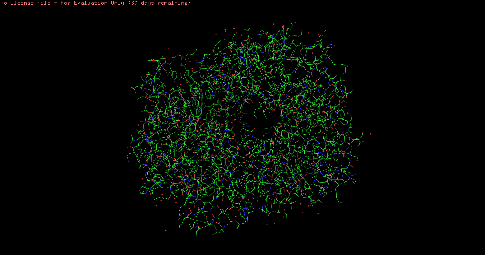
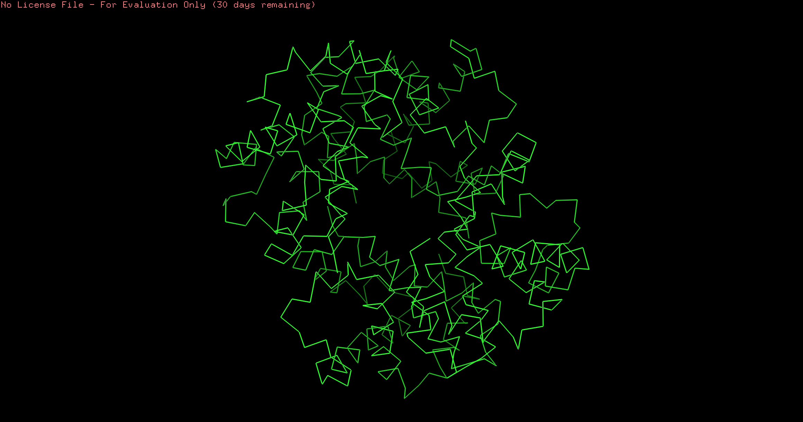
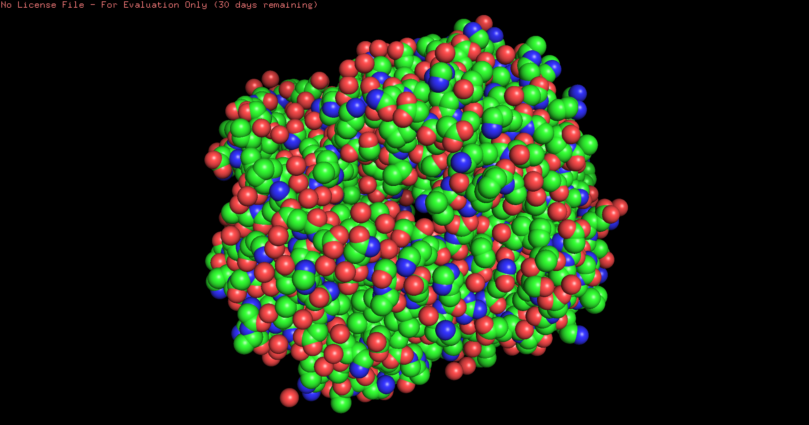
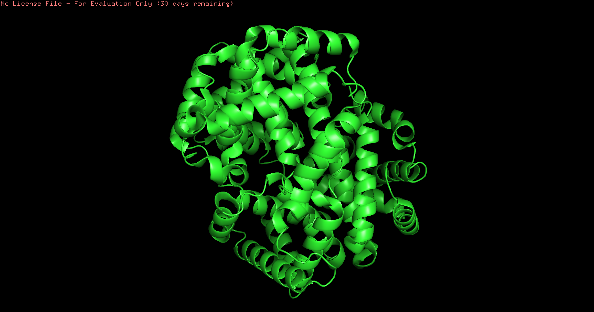
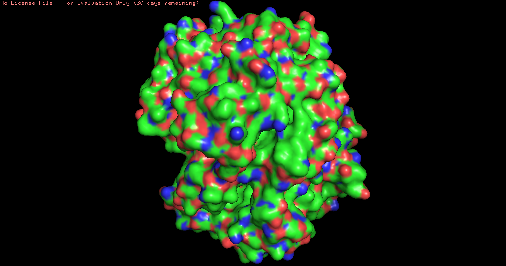
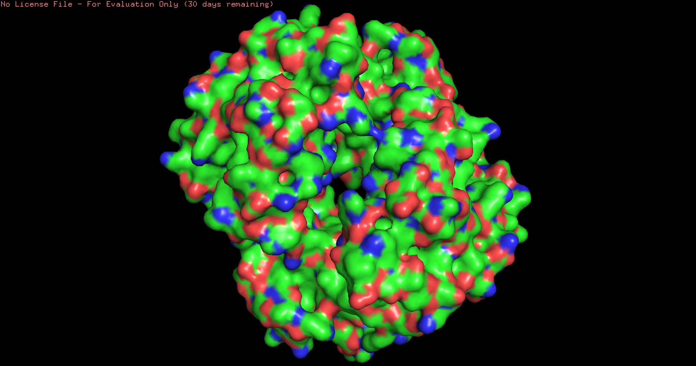
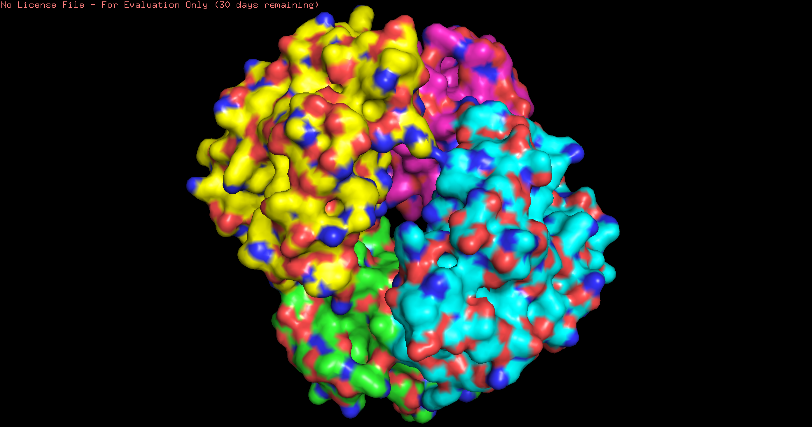
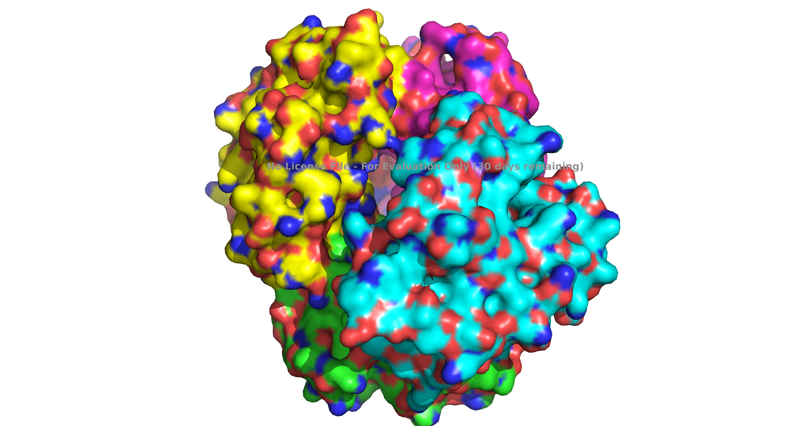

# Визуализация белковой структуры с помощью PyMOL

В этом проекте выполняется визуализация структуры белка с использованием программного обеспечения **PyMOL** 

## 1. Программное обеспечение и структура белка

*   **Использованное ПО**: [PyMOL](https://pymol.org/2/)
*   **Выбранная структура белка**: **Гемоглобин (Homo sapiens)**
    *   **PDB ID**: [1GZX](https://www.rcsb.org/structure/1GZX)
    *   **Описание**: Тетрамерный белок, переносящий кислород в крови. Состоит из двух альфа- и двух бета-субъединиц (цепей), что идеально для демонстрации раскраски по доменам.

## 2. Изображения белка с различными визуализациями

В этом разделе представлены скриншоты интерфейса PyMOL во время настройки (`* screen.png`) и итоговые рендеры белковой структуры (`*.png`).

### a. Wireframe (Проволочная модель)
*   **Способ получения**: Скрыты стандартные линии (`H > lines`), отображены связи в виде "палочек" (`S > wire`).
*   **Итоговое изображение**:
    
    *Скриншот процесса*: 

### b. Backbone (Модель остова)
*   **Способ получения**: Использована командная строка PyMOL: `S > ribbon`, лишние элементы скрыты.
*   **Итоговое изображение**:
    
    *Скриншот процесса*: 

### c. Spacefill (Шаростержневая модель)
*   **Способ получения**: Атомы отображены как сферы (`S > spheres`).
*   **Итоговое изображение**:
    
    *Скриншот процесса*: 

### d. Ribbons (Ленточная модель)
*   **Способ получения**: Отображена вторичная структура (`S > cartoon`), (странно, конечно, но это больше всего похоже на ленточки) лишние элементы скрыты.
*   **Итоговое изображение**:
    
    *Скриншот процесса*: 

### e. Molecular Surface (Молекулярная поверхность)
*   **Способ получения**: Отображена растворимая поверхность белка (`S > surface`).
*   **Итоговое изображение**:
    
    *Скриншот процесса*: 

## 3. Раскраска структуры

Для демонстрации раскраски использовались наиболее наглядные представления: **Molecular Surface** для CPK и **Ribbons** для доменов.

### a. Раскраска цветовой моделью CPK (по химическим элементам)
*   **Способ получения**: На визуализации поверхности применена раскраска `C > by element`.
*   **Результат (Цвета: C-серый, O-красный, N-синий)**:
    
    *Скриншот процесса*: 

### b. Раскраска по доменам (субъединицам/цепям)
*   **Способ получения**: На ленточной модели применена раскраска `C > by chain`.
*   **Результат (Каждая цепь тетрамера окрашена в свой цвет)**:
    
    *Скриншот процесса*: 

## 4. Изображение публикационного качества

В качестве итогового изображения публикационного качества представлена ленточная модель (ribbons) гемоглобина, раскрашенная по доменам (цепям). Это позволяет четко различить четыре субъединицы белка и оценить его пространственную организацию.

**Финальная визуализация (рендер с трассировкой лучей)**:

